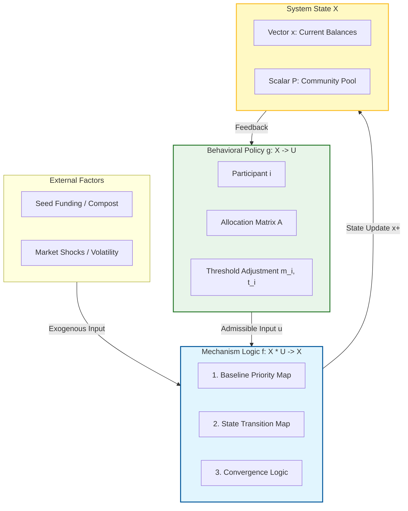
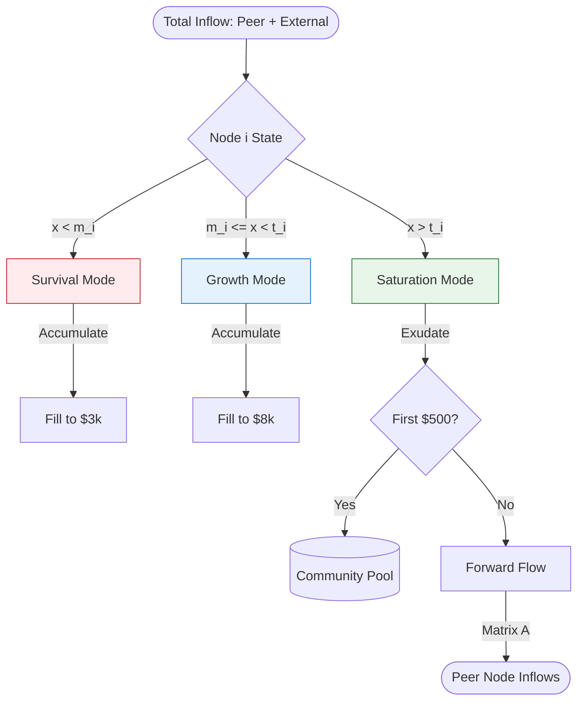
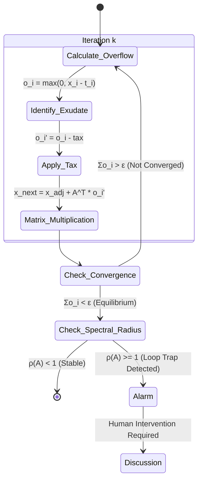
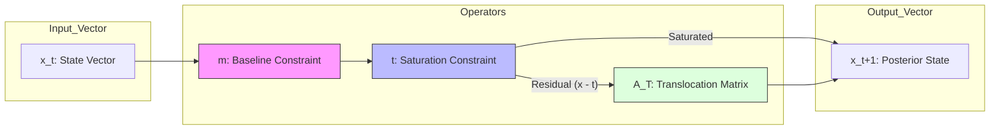

# TBFF High-Fidelity Engineering Specification

This document provides advanced **Model-Based Systems Engineering (MBSE)** diagrams for the TBFF **Generalized Dynamical System (GDS)**.

## 1. GDS Functional Block Diagram
This separates the **Behavioral Policy** (Participant Choices) from the **Mechanism Logic** (The Protocol).

## 2. The Internal "Nutrient Waterfall" (Node Logic Gate)
Detailed internal processing for a single participant node $i$.

## 3. Recursive Convergence State-Machine
The iterative process for the redistribution of overflow until equilibrium is reached.

## 4. Matrix-Vector Transition Logic
The mathematical mapping of the state update $x^+ = f(x,u)$.

