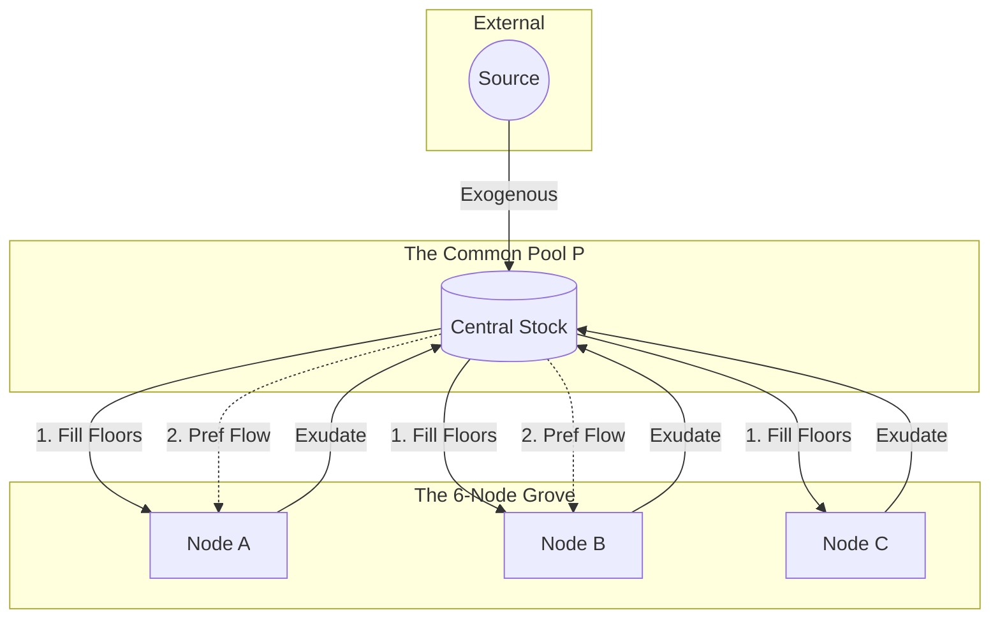
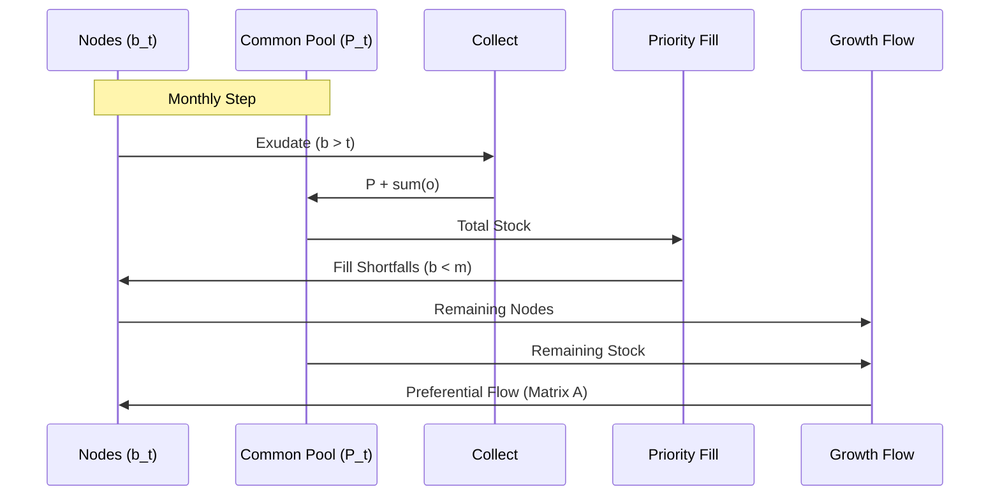

# TBFF Engineering Specification: Common Pool Visuals

## 1. Stock and Flow Diagram (Hub-and-Spoke)

```mermaid
graph TD
    subgraph External
        Source((Source))
    end

    subgraph Hub [The Common Pool P]
        Reservoir[(Central Stock)]
    end

    subgraph Nodes [The 6-Node Grove]
        Node1[Node A]
        Node2[Node B]
        Node3[Node C]
    end

    %% Collection
    Source -->|Exogenous| Reservoir
    Node1 -->|Exudate| Reservoir
    Node2 -->|Exudate| Reservoir
    Node3 -->|Exudate| Reservoir

    %% Distribution
    Reservoir -->|1. Fill Floors| Node1
    Reservoir -->|1. Fill Floors| Node2
    Reservoir -->|1. Fill Floors| Node3

    Reservoir -.->|2. Pref Flow| Node1
    Reservoir -.->|2. Pref Flow| Node2
```

## 2. cadCAD Transition Logic (Common Pool)

```mermaid
sequenceDiagram
    participant N as Nodes (b_t)
    participant P as Common Pool (P_t)
    participant PS1 as Collect
    participant PS2 as Priority Fill
    participant PS3 as Growth Flow

    Note over N, P: Monthly Step
    N->>PS1: Exudate (b > t)
    PS1->>P: P + sum(o)
    P->>PS2: Total Stock
    PS2->>N: Fill Shortfalls (b < m)
    N->>PS3: Remaining Nodes
    P->>PS3: Remaining Stock
    PS3->>N: Preferential Flow (Matrix A)
```
