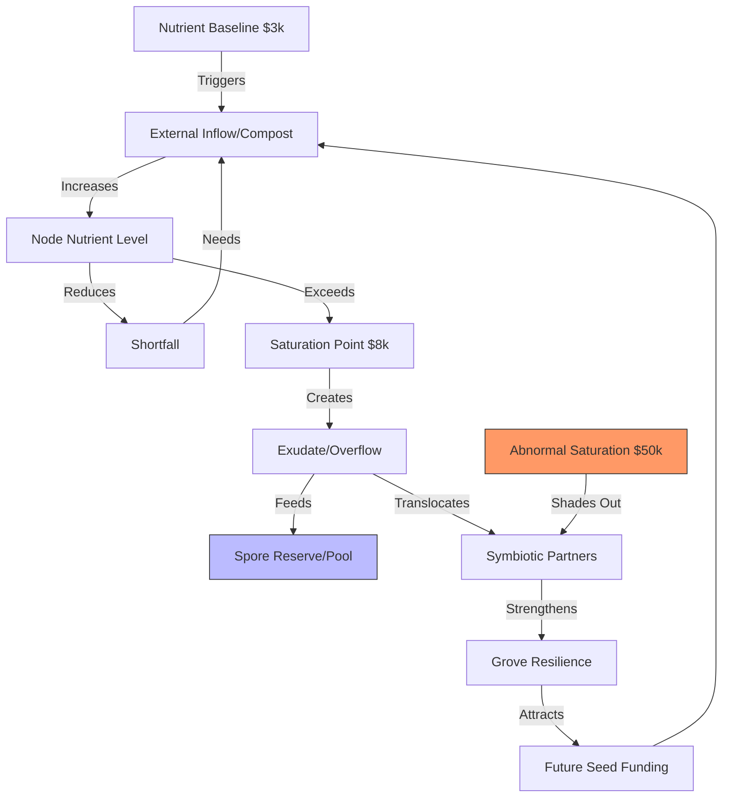
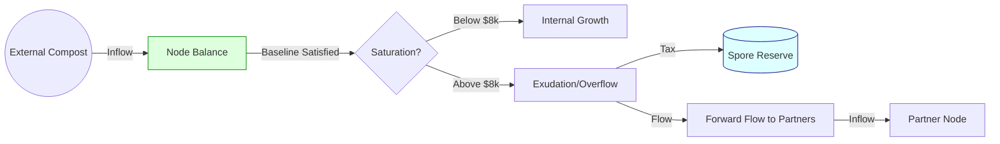
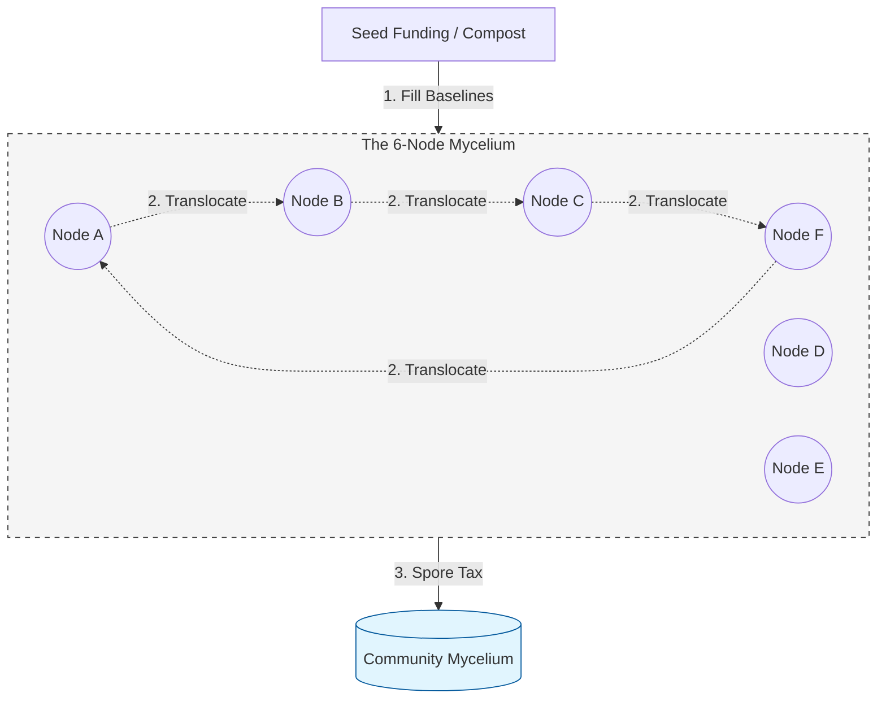
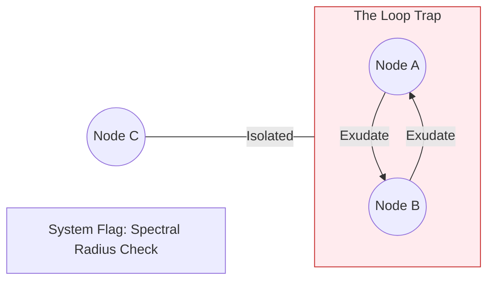

# TBFF Visual Ecosystem

This document provides visual maps of the **Mycelial Pulse** mechanism using Causal Loop Diagrams (CLD) and Stock & Flow representations.

## 1. Causal Loop Diagram: The Nutrient Pulse
This diagram shows how the system balances itself. We want to avoid "Overgrowth" (Hoarding) and encourage "Symbiosis" (Sharing).

## 2. Stock & Flow: Nutrient Translocation
This is the "Plumbing" (Ecological Version). It shows how the nutrients actually move through a single node.

## 3. The 6-Node Grove (The Network)
This shows the 6-person cohort with the **Baseline Priority** rule active.

## 4. Stability Check: The Loop Trap
We monitor the network for "closed circuits" that don't let nutrients reach the edges.

